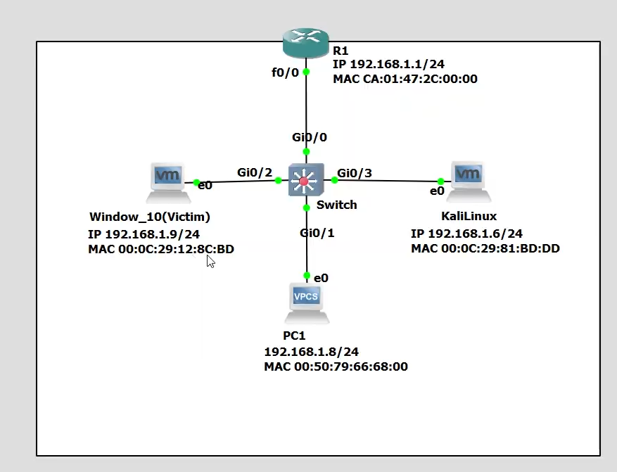

# Tìm hiểu phương pháp tấn công ARP spoofing
Video demo kết quả: https://drive.google.com/file/d/1a7-xC8VH5uqeKXG2GPDaJvr6yBN0Hkkb/view
## Yêu cầu tối thiểu về nội dung lý thuyết:
- Tổng quan về ARP spoofing (khái niệm, phân loại, cách tiến hành, ...).
- Mối liên hệ giữa phương pháp tấn công này với một số phương pháp tấn công khác.
- Cách phòng chống tấn công.
## Yêu cầu tối thiểu về nội dung demo:
- Demo 1 phương pháp tấn công có sử dụng ARP spoofing.
- Demo giải pháp phòng chống.

## Thành viên
- Hồ Hữu Đại       3122410066
- Huỳnh Tấn Dương  3122410061

- MÔ HÌNH MẠNG


## I. CẤU HÌNH DHCP Ở SWITCH
- ```config terminal```
- ```ip dhcp excluded-address 192.168.1.1 192.168.1.5``` (Không cấp dãy ip 192.168.1.1->192.168.1.5 cho clientclient)
- ```ip dhcp pool DHCP_ARP``` (đặt tên cho pool DHCPDHCP)
- ```network 192.168.1.0 255.255.255.0``` (dãy mạng được dùng để cấp phát)
- ```default-router 192.168.1.1``` (chỉ định default gatewaygateway)
- ```dns-server 8.8.8.8 1.1.1.1`` (chỉ định DNS serverserver)
- ```end```
- ```show run | s dhcp``` (kiểm tra DHCP đã hoạt động chưa)


## II. Nguyên lý phòng chống
- DHCP Snooping xây dựng một cơ sở dữ liệu ánh xạ (binding table) giữa địa chỉ IP, MAC, cổng switch và VLAN, dựa trên các gói tin DHCP hợp lệ khi có yêu cầu cấp phát địa chỉ IP từ client đến DHCP server.
- Dynamic ARP Inspection (DAI) là một cơ chế bảo mật dùng để ngăn chặn ARP Spoofing, nó kiểm tra tính hợp lệ của các gói ARP bằng cách so sánh thông tin trong gói ARP với cơ sở dữ liệu binding của DHCP Snooping.

- So sánh IP-MAC trong gói ARP với thông tin trong DHCP Snooping binding table:
- Nếu đúng: cho phép gói ARP đi qua.
- Nếu sai: chặn gói ARP lại và có thể log hoặc báo động.
- Ngăn chặn kẻ tấn công giả mạo địa chỉ MAC/IP để đánh lừa client hoặc gateway.

- Trong trường hợp kẻ tấn công sẽ cố gắng để gửi gói tin ARP reply đến nạn nhân và gateway với cặp MAC-IP của các gói tin ARP reply sẽ có dạng là (MAC kẻ tấn công - IP nạn nhân) gửi đến cho gateway và (MAC kẻ tấn công - IP gateway) gửi đến cho nạn nhân, tuy nhiên nếu các gói tin này phải đi qua switch được cài đặt DAI kết hợp DHCP Snooping thì tại đây các gói tin sẽ bị lọc, theo binding table thì cặp MAC-IP của kẻ tấn công là (MAC kẻ tấn công - IP kẻ tấn công) không khớp với các gói ARP reply của kẻ tấn công (MAC kẻ tấn công - IP nạn nhân) hoặc (MAC kẻ tấn công - IP gateway), nên 2 gói này đều sẽ bị đánh rớt và không đến được gateway/nạn nhân.

## III. CẤU HÌNH DHCP SNOOPING
- ```config terminal```
- ```ip dhcp snooping```
- ```ip dhcp snooping vlan 1``` (cài đặt DHCP Snooping cho Vlan 1)
- ```show ip dhcp snooping binding``` (show ra bảng binding)

## IV. CẤU HÌNH DYNAMIC ARP INSPECTION
- ```config terminal```
- ```ip arp inspection vlan 1``` (cài đặt DAI cho VLan 1)
- ```ip arp inspection validate src-mac dst-mac ip```
- ```interface GigabitEthernet0/0```(cổng từ switch đến router không cần kiểm tra nên để trust )
- ```ip arp inspection trust ```
- ```end```

- ```no ip arp inspection vlan 1``` (Tắt DAI)
- ```show ip arp inspection interfaces``` (Xem bảng trust/untrust)
- ```show run | s arp``` ( kiểm tra DAI chạy chưa)

## V. CẤU HÌNH TELNET Ở ROUTER
- ```enable secret cisco```
- ```line vty 0 4```
- ```password 123```
- ```login```

## VI. THỰC HIỆN TẤN CÔNG ARP SPOOFING
- ```sudo sysctl -w net.ipv4.ip_forward=1``` (forward gói tin về lại client)

- ```nmap -sn 192.168.1.0/24``` (liệt kê host đang hoạt động, để tìm ra gateway và nạn nhân )
- ```arpspoof -i eth0 -t 192.168.1.9 -r 192.168.1.1```(trường hợp gateway có IP là 192.168.1.1 và nạn nhân có IP là 192.168.1.9, tiến hành tấn công ARPSpoof )
